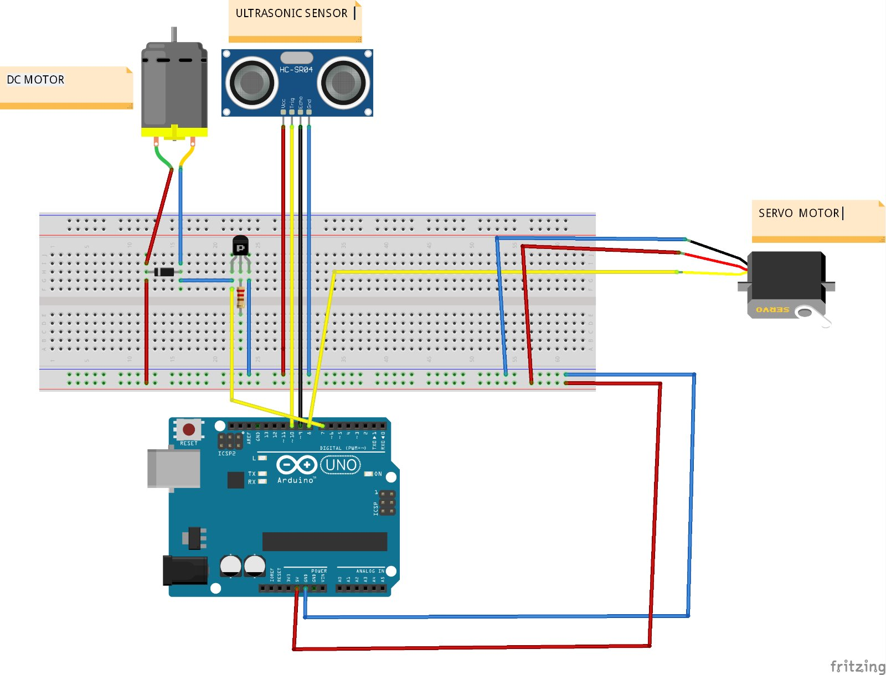
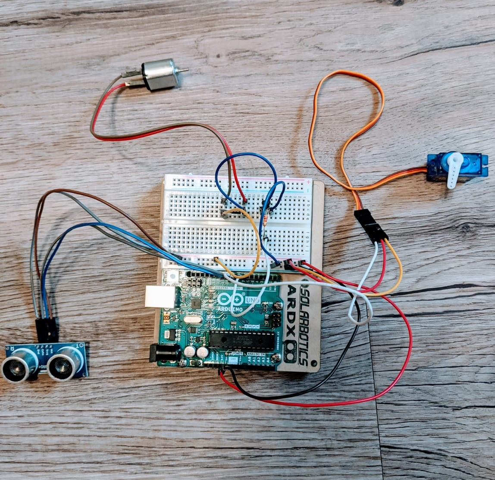
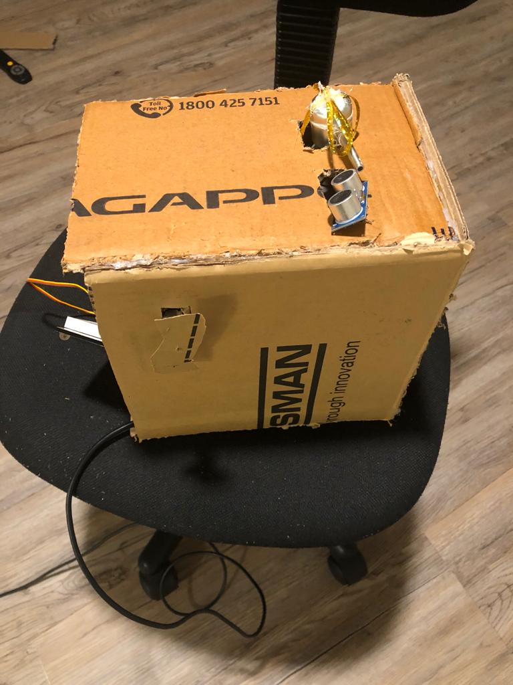

# cs-207-project
Group project(Manan,preet,nisarg)

# Introduction 

The project which we are going to do in this term is an automatic sensor soap dispenser. This was done so that people can easily get soap and need not to touch the dispenser. In this way it is very hygienic as the dispenser have germs on it and also as there this virus going around in the world which spreads due to contact it would be very nice that we would not have to touch the dispenser. If this type of machine is applied in public places such as hospitals, schools it could prevent these diseases to spread from one person to another. This is comparatively very cheap as this type of machine can be setup in less than $45. The structure of the dispensing machine is the simple structure where we will keep our hand and the soap comes out from it. A simple modification is done by us that when the person washes his/her hands there is a hand dryer which passes hot air which will eventually dry their hands. 

# Materials used

Ultrasonic sensor

Dispensing Air Pump

DC Motor

DIODES

TRANSISTORS

RESISTOR

# Circuit Diagram

# Circuit assemble

# Model

